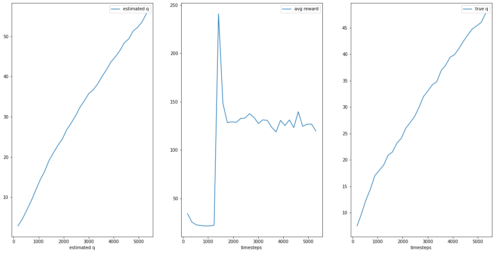

# Miranda Morris / AIPI 530 Fall 2021 / Reinforcement Learning

This is the deep reinforcement learning repository for my AIPI530  final project in which a **customized training CQL** is used on a dataset found in the offline deep reinforcement learning library entitled **d3rlpy**.

**Documentation:** https://d3rlpy.readthedocs.io

**Paper:** https://arxiv.org/abs/2111.03788

**Objective**: Build a pipeline for offline RL. 
Starter code is forked from [**d3rlpy**](https://github.com/takuseno/d3rlpy)

To begin, I documented what I have learned about reinforcement learning (RL) in a blog post: https://mirandaxmorris.wixsite.com/blog

The [blog](https://mirandaxmorris.wixsite.com/blog) discusses online versus offline reinforcement learning, the pros and cons of each, and when to apply versus not apply the methods.
I also describe the difference between supervised learning and RL and share an real-world example of reinforcement learning being applied to the healthcare field. If interested, see the articles linked in the blog for further reading.

# Background from d3rlpy Source Author:
* **offline RL:** d3rlpy supports state-of-the-art offline RL algorithms. Offline RL is extremely powerful when the online interaction is not feasible during training (e.g. robotics, medical).
* **online RL:** d3rlpy also supports conventional state-of-the-art online training algorithms without any compromising, which means that you can solve any kinds of RL problems only with d3rlpy.
* **advanced engineering:** d3rlpy is designed to implement the faster and efficient training algorithms. For example, you can train Atari environments with x4 less memory space and as fast as the fastest RL library.
 
d3rlpy supports Linux, macOS and Windows.
PyPI (recommended): `$ pip install d3rlpy`
Anaconda: `$ conda install -c conda-forge d3rlpy`
Docker: `$ docker run -it --gpus all --name d3rlpy takuseno/d3rlpy:latest bash`


### Notebook Walk-Through 
[](https://colab.research.google.com/drive/19xizG5JGTMsXHRCFckbxR9Yr5Zc8n59U?usp=sharing)


# Installation & Getting Started:

1. Clone this repository: `gh repo clone mxm32/OfflineRL`
2. Read [d3rlpy > tutorials](https://github.com/takuseno/d3rlpy/tree/master/tutorials) for background
3. Install `pybullet` module from source author: `gh repo clone takuseno/d4rl-pybullet`
4. `$ pip install -e `and `$ pip install Cython numpy`
5. Run `cql_train.py`

***Analysis***
* Log Estimated Q values vs training steps: (d3rlpy_logs/CQL_hopper-bullet-mixed-v0_1/init_value.csv)
* Average reward vs training steps: (d3rlpy_logs/CQL_hopper-bullet-mixed-v0_1/environment.csv)
* True Q values vs training steps: (d3rlpy_logs/CQL_hopper-bullet-mixed-v0_1/true_q_value.csv)


### Analysis & Plots: 

**CQL Metrics**


**CQL Plots**


**FQE Metrics**


**FQE Plot**


### Examples Using d3rlpy:  
```py
import d3rlpy

dataset, env = d3rlpy.datasets.get_dataset("hopper-medium-v0")

# prepare algorithm
sac = d3rlpy.algos.SAC()

# train offline
sac.fit(dataset, n_steps=1000000)

# train online
sac.fit_online(env, n_steps=1000000)

# ready to control
actions = sac.predict(x)
```

### MuJoCo
```py
import d3rlpy

# prepare dataset
dataset, env = d3rlpy.datasets.get_d4rl('hopper-medium-v0')

# prepare algorithm
cql = d3rlpy.algos.CQL(use_gpu=True)

# train
cql.fit(dataset,
        eval_episodes=dataset,
        n_epochs=100,
        scorers={
            'environment': d3rlpy.metrics.evaluate_on_environment(env),
            'td_error': d3rlpy.metrics.td_error_scorer
        })
```
See more datasets at [d4rl](https://github.com/rail-berkeley/d4rl).

### Atari 2600
```py
import d3rlpy
from sklearn.model_selection import train_test_split

# prepare dataset
dataset, env = d3rlpy.datasets.get_atari('breakout-expert-v0')

# split dataset
train_episodes, test_episodes = train_test_split(dataset, test_size=0.1)

# prepare algorithm
cql = d3rlpy.algos.DiscreteCQL(n_frames=4, q_func_factory='qr', scaler='pixel', use_gpu=True)

# start training
cql.fit(train_episodes,
        eval_episodes=test_episodes,
        n_epochs=100,
        scorers={
            'environment': d3rlpy.metrics.evaluate_on_environment(env),
            'td_error': d3rlpy.metrics.td_error_scorer
        })
```
See more Atari datasets at [d4rl-atari](https://github.com/takuseno/d4rl-atari).

### PyBullet

```py
import d3rlpy

# prepare dataset
dataset, env = d3rlpy.datasets.get_pybullet('hopper-bullet-mixed-v0')

# prepare algorithm
cql = d3rlpy.algos.CQL(use_gpu=True)

# start training
cql.fit(dataset,
        eval_episodes=dataset,
        n_epochs=100,
        scorers={
            'environment': d3rlpy.metrics.evaluate_on_environment(env),
            'td_error': d3rlpy.metrics.td_error_scorer
        })
```
See more PyBullet datasets at [d4rl-pybullet](https://github.com/takuseno/d4rl-pybullet).

## More Tutorials
Try a cartpole example on Google Colaboratory:
 * official offline RL tutorial: [](https://colab.research.google.com/github/takuseno/d3rlpy/blob/master/tutorials/cartpole.ipynb)

## Citation
The paper is available [here](https://arxiv.org/abs/2111.03788).
```
@InProceedings{seno2021d3rlpy,
  author = {Takuma Seno, Michita Imai},
  title = {d3rlpy: An Offline Deep Reinforcement Library},
  booktitle = {NeurIPS 2021 Offline Reinforcement Learning Workshop},
  month = {December},
  year = {2021}
}
```
